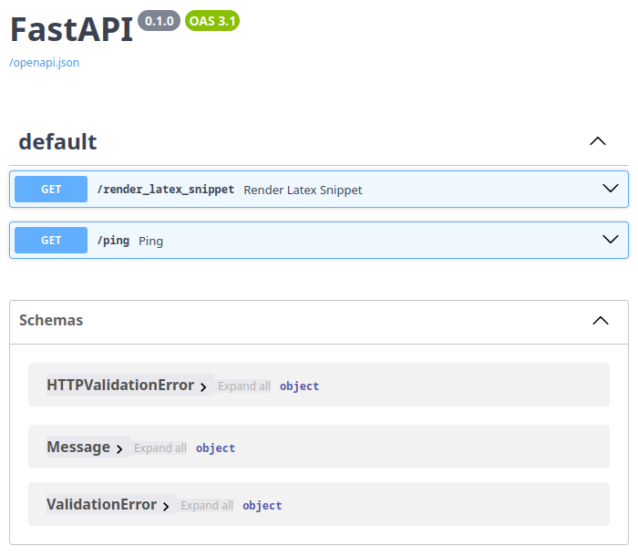
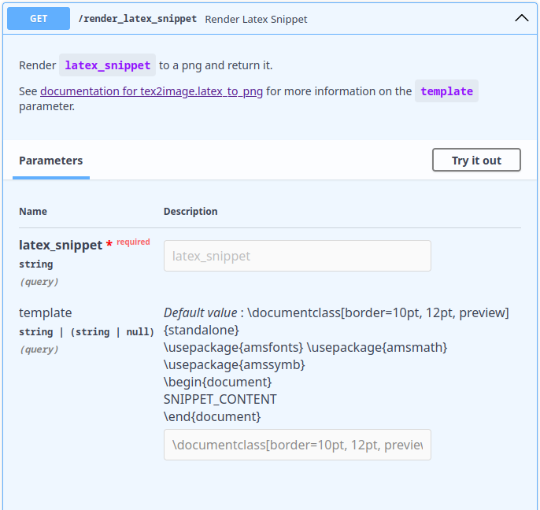
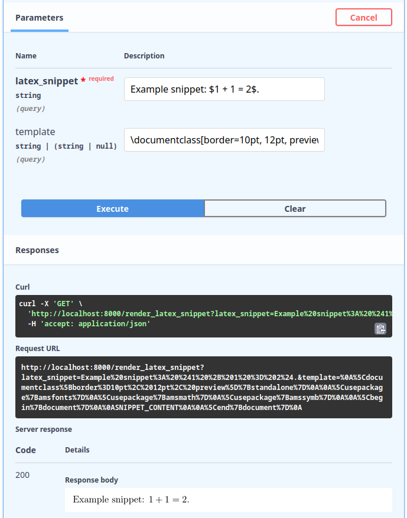

For this example, simply run

```bash
docker run --rm -p 8000:8000 -it ghcr.io/olympiad-bot/tex2image
```

and then navigate to `http://localhost:8000/docs` in your browser.



Next click `/render_latex_snippet`, and then "Try it out".



Then fill in the `latex_snippet` box with the snippet you want to render, and
click execute.


